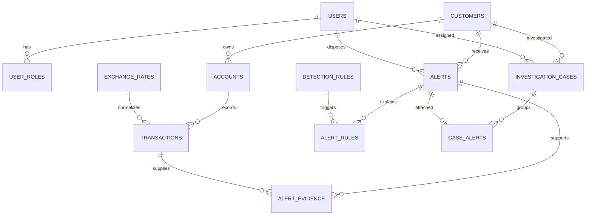

# Sentinel AML schema

Flyway runs V1/V2 for existing authentication and V3 for AML. Existing migrations are unchanged. Hibernate validates mappings; it does not create or update tables.

- `customers.id`, `accounts.id`, and `transactions.id` retain external source identifiers, up to 64 characters. These are integration keys, not government ID numbers.
- Money uses `NUMERIC`, Java `BigDecimal`, and two decimal places. FX rates use eight decimals. Each transaction snapshots its INR conversion rate, normalized INR value and USD-equivalent value. Currency updates do not rewrite past records.
- `transactions.direction`: `IN` represents a deposit/credit and `OUT` a withdrawal/outgoing transfer. This is a monitoring store, not a balance-posting ledger; `current_balance` is imported account metadata.
- Account and transaction ownership is immutable through the API. Customer → accounts → transactions foreign keys are mandatory.
- One active (`OPEN` or `IN_REVIEW`) alert per customer is enforced by a PostgreSQL partial unique index. Distinct rule weights sum to a score capped at 100. Rule configuration and explanation snapshots are attached to each alert; evidence is a deduplicated set of transaction IDs.
- Alerts can belong to one case, and all alerts in a case must refer to the same customer. Assignment and disposition reference existing application usernames.
- `audit_events` is an append-only event table for alert/case workflows and rule/rate/watchlist changes. PostgreSQL triggers reject UPDATE, DELETE and TRUNCATE. Another trigger prevents deleting/truncating alerts. There are no API delete operations for these resources. Database owners can change triggers; use a restricted application database role in deployment.
- Composite indexes support account/time history and risk-sorted alert queues. Customer row locks serialize ingestion and alert disposition across instances, including activity across several accounts of the same customer. Persistence and detection share a transaction.
- `risk_watchlist` holds case-normalized exact-match jurisdictions/counterparties. It is empty initially; operators must supply their approved list.
